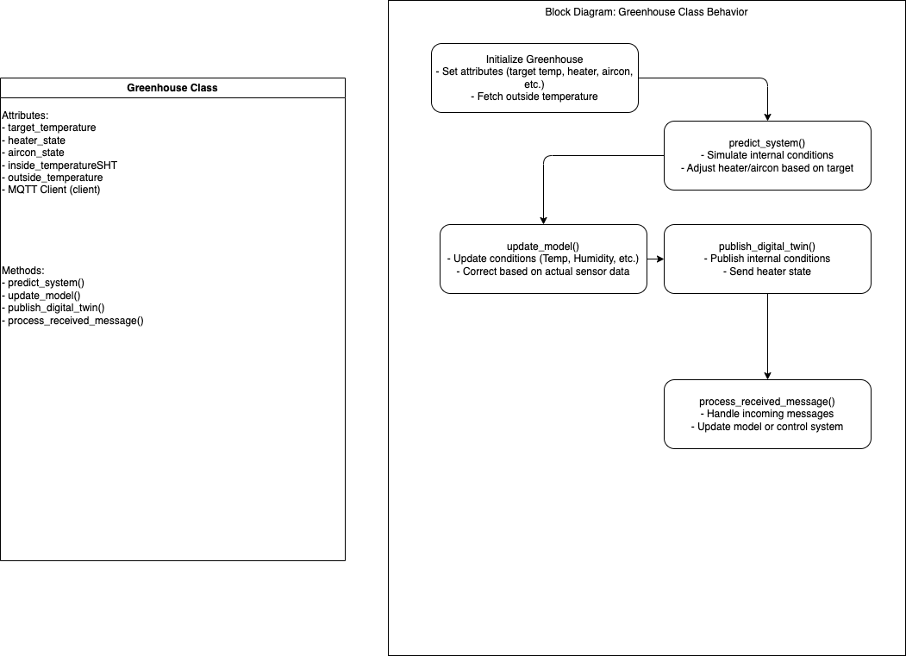
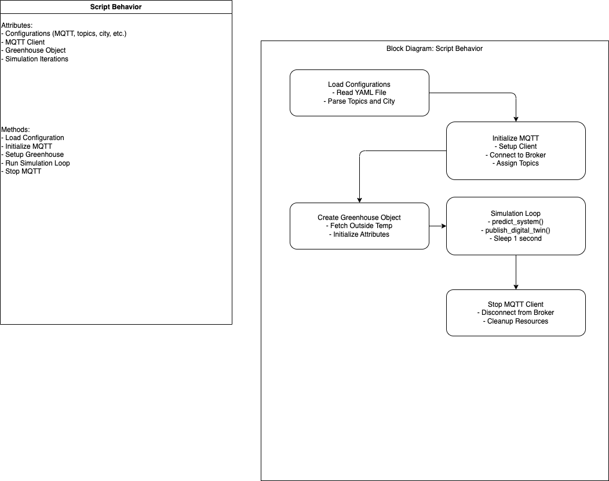
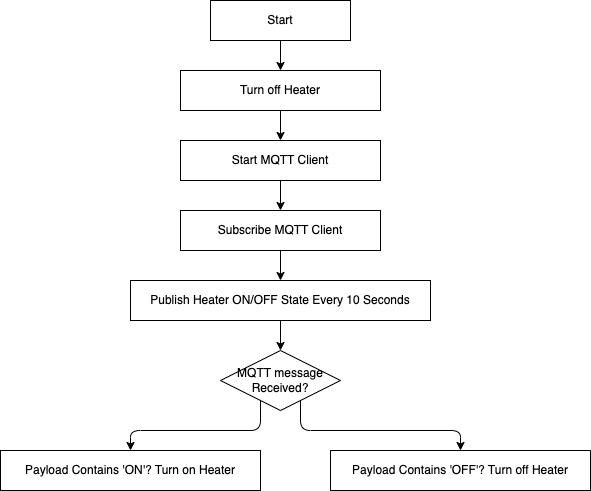

# Digital twin simulation

## Prerequists

### Hardware

1. Linux PC
2. M5stack core
3. M5Stack SH4X sensor
4. SmartBot hub
5. SmartBot plug
6. SmartBot bot
7. Heater
6. Neccessary cabels

### Software

1. Arduino IDE
2. Smartbot app to get api token
3. Preffered IDE with build tools

### Configuration
Update m5stack-shana/digitaltwin-demo/config.yml with your configuration

## Setup

### Hardware connections

1. Connect sensor to M5stack
2. Connect M5Stack to PC
3. Connect all the devices to same WIFI network
4. set a static IP for Linux PC

### M5stack

1. Connect M5stack to PC
2. Update the WIFI SSID, Passkey, server IP in [src](m5stack_pub_data/m5stack_pub_data.ino)
2. Use arduino IDE to program m5stack [src](m5stack_pub_data/m5stack_pub_data.ino)


### Switchbot

1. Connect bot to heater button
2. Connect heater to power through switchbot plug for safety
3. Connect and sync all the switchbot devices to swithbot app and generate token and secret and update them in config

### Linux PC

1. Install dependencies

```
cd REPO_DIR
./ci_tests.sh install_dependencies
```

2. Setup mosquitto MQTT server

```
cd REPO_DIR
./ci_tests.sh setup_local_server
```

3. Setup nodered

```
cd REPO_DIR
./ci_tests.sh nodered
```

4. Setup heater control

```
cd REPO_DIR
./ci_tests.sh setup_heater_control
```

4. Setup sim control

```
cd REPO_DIR
./ci_tests.sh setup_sim
```
## Notes

### Greenhouse class



### Digitaltwin simulator



### Heater Controller 


